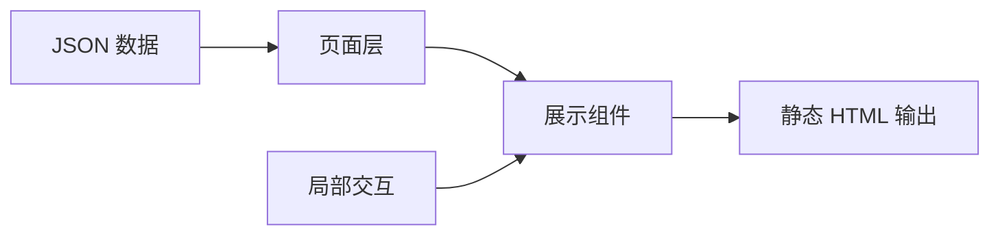

# 个人主页网站技术架构与实现方案

## 1. 目标与边界

本网站是一个个人展示站，首版聚焦 Home、About、Products、Projects、Contact 五个页面。核心目标是让访问者快速进入产品、查看项目和完成联系，同时形成“动态围棋棋盘 + 极简入口”的视觉记忆点。

首版采用轻量静态架构，不做登录、评论、CMS（内容管理系统）、搜索、产品详情页、项目详情页、复杂 3D（立体图形）棋盘和服务端 API（后端接口）。后续功能通过清晰模块边界扩展，但不提前引入不必要的复杂抽象。

## 2. 推荐技术栈

- Astro（静态站点生成框架）：负责页面路由、静态生成、SEO（搜索引擎优化）和构建输出。
- Tailwind CSS（原子化样式框架）：负责快速实现统一视觉系统、响应式布局和设计令牌。
- TypeScript（带类型的 JavaScript）：约束产品、项目、状态和链接数据，降低内容维护错误。
- React Islands（局部交互组件模式）：只用于邮箱复制、轻量交互反馈等需要状态的局部区域。
- Vitest（单元测试框架）与 Playwright（浏览器自动化测试工具）：分别覆盖数据逻辑和页面行为。
- Render Static Site（Render 静态站托管）：用于部署静态构建产物。

该组合兼顾视觉表现、性能、维护效率和后续扩展，适合个人主页的 MVP（最小可用版本）。

## 3. 架构原则

### 3.1 模块解耦

系统按职责分为页面层、组件层、数据层、样式层和交互层：

- 页面层只负责组装内容，不写复杂业务逻辑。
- 组件层只负责可复用 UI（用户界面），例如卡片、按钮、徽章和棋盘背景。
- 数据层只保存结构化 JSON（轻量数据格式），不把内容散落在多个页面里。
- 样式层统一管理颜色、间距、动效和响应式规则。
- 交互层只处理必要的局部状态，不引入全局状态管理。

### 3.2 避免过度设计

首版不引入 Redux（全局状态管理库）、Zustand（轻量状态管理库）、依赖注入、插件系统、服务层目录、复杂领域模型或后台管理系统。产品和项目数量少时，直接读取本地 JSON（轻量数据格式）即可。

只有当产品数量超过 8 个、内容维护频率明显提升、或需要多人协作更新内容时，再考虑搜索、筛选、MDX（Markdown 与组件混写格式）或 CMS（内容管理系统）。

## 4. 目录结构

```text
src/
  pages/
    index.astro
    about.astro
    products.astro
    projects.astro
    contact.astro
  components/
    layout/
      SiteLayout.astro
      Header.astro
      Footer.astro
    ui/
      SciFiCard.astro
      StoneButton.astro
      SectionHeader.astro
    board/
      BoardBackground.astro
      StoneStatusBadge.astro
    products/
      ProductCard.astro
    projects/
      ProjectCard.astro
  data/
    profile.json
    products.json
    projects.json
  styles/
    global.css
public/
  favicon.svg
  og-image.png
```

目录保持浅层结构。只有出现三个以上同类组件时才新增子目录，避免为了“看起来架构完整”而拆分过细。

## 5. 页面与数据流

页面从 `src/data/` 读取 JSON（轻量数据格式）内容，并传递给展示组件。组件不直接修改数据，也不承担数据筛选以外的复杂逻辑。



数据类型建议：

```ts
type ProductStatus = "Live" | "Beta" | "Building" | "Idea" | "Archived";
type ProjectStatus = "Active" | "Completed" | "Archived";
```

首页只读取 `featured: true` 的 2-3 个产品和项目。Products 页面展示所有产品。Projects 页面展示所有项目。Contact 页面读取 profile（个人资料）中的邮箱和社交链接。

## 6. 核心组件设计

- `SiteLayout`：统一页面外壳、导航、页脚、SEO（搜索引擎优化）信息和 Open Graph（社交分享元数据）。
- `BoardBackground`：使用 CSS（层叠样式表）渐变或 SVG（可缩放矢量图）绘制棋盘背景，支持密度、透明度和星位显示。
- `StoneStatusBadge`：展示棋子视觉和状态文字，状态不能只靠颜色表达。
- `SciFiCard`：通用玻璃拟态卡片，包含 1px 微光边框、HUD（科幻抬头显示界面）角线和轻量 hover（悬停）反馈。
- `ProductCard`：展示产品名称、描述、状态、分类、技术栈、Launch（访问入口）和 Repo（代码仓库）按钮。
- `ProjectCard`：展示项目标题、摘要、技术栈、状态、结果和外链。
- `StoneButton`：统一 CTA（行动按钮）、复制、外链和 Coming Soon（即将开放）状态。

组件只暴露必要 props（组件输入参数）。不要为了未来可能性提前加入大量配置项。

## 7. 视觉实现方案

视觉目标参考主流优秀个人站和产品官网的高级感：首屏有记忆点，内容清晰，细节精致。默认采用“高级轻量”路线，不在首版引入 Three.js（3D 图形库）或 Spline（3D 设计工具）。

关键设计：

- 深色空间背景承载整体氛围。
- 低透明 19x19 棋盘作为主视觉纹理。
- 星位点、悬浮棋子和 HUD（科幻抬头显示界面）细线形成围棋 + 科幻识别。
- 产品和项目卡片使用深色玻璃拟态，但控制透明度、模糊和发光强度。
- CTA（行动按钮）和重点卡片使用霓光青、星位金作为少量强调色。

动效控制在 150-300ms。页面进入使用轻微 fade（淡入）和 translate（位移）；卡片 hover（悬停）上浮 2px；按钮点击显示一次落子波纹。所有动效支持 `prefers-reduced-motion`（减少动态效果偏好）。

## 8. 响应式与可访问性

- 桌面端：Hero（首屏主视觉）可左右分栏，Products 三列，Projects 两到三列。
- 平板端：Hero（首屏主视觉）上下布局，Products 两列。
- 移动端：所有卡片单列，减少棋盘背景密度，隐藏非必要 HUD（科幻抬头显示界面）细节。
- 所有按钮必须支持键盘 focus（焦点状态）。
- 状态必须同时显示图形和文字，不能只依赖颜色。
- 图片必须提供 alt（替代文本）。
- 背景棋盘透明度控制在 4%-10%，不得影响正文阅读。

## 9. 构建、测试与部署

建议命令：

```text
npm install
npm run dev
npm run build
npm run preview
npm test
```

测试要求：

- `npm run build` 必须成功。
- TypeScript（带类型的 JavaScript）检查产品和项目数据结构。
- Vitest（单元测试框架）覆盖状态映射、链接降级和精选内容筛选。
- Playwright（浏览器自动化测试工具）覆盖五个页面、导航、外链、邮箱复制和移动端无横向滚动。
- Lighthouse（网页质量评分工具）Performance 和 Accessibility 均达到 90 以上。

Render Static Site（Render 静态站托管）配置：

```text
Build Command: npm install && npm run build
Publish Directory: dist
```

## 10. 后续扩展策略

后续扩展按实际需求触发，不提前实现：

- 产品超过 8 个后，再加入搜索和分类筛选。
- 项目需要展开过程和复盘时，再加入项目详情页。
- 需要持续发布文章时，再加入 Notes（笔记）和 MDX（Markdown 与组件混写格式）。
- 内容更新频繁或多人维护时，再考虑 CMS（内容管理系统）。
- 需要更强视觉展示时，再评估 Three.js（3D 图形库）或 Spline（3D 设计工具），但必须单独做性能验证。

首版的正确方向是：结构清楚、组件复用、视觉惊艳、性能稳定，而不是为了架构完整牺牲实现效率。
